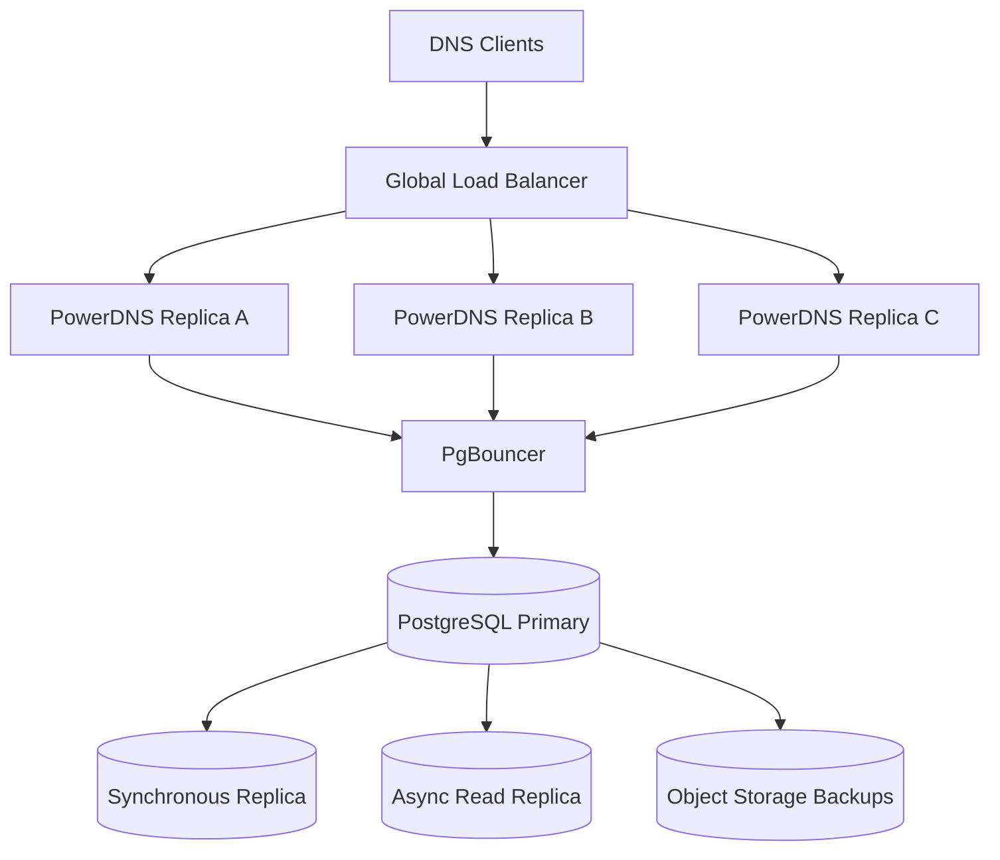

# HA Topology

## Failure handling

- PowerDNS replica failure is handled by Kubernetes rescheduling.
- PostgreSQL primary failure is handled by the HA backend operator.
- backup restore is the last resort for data corruption or region-wide failure.
